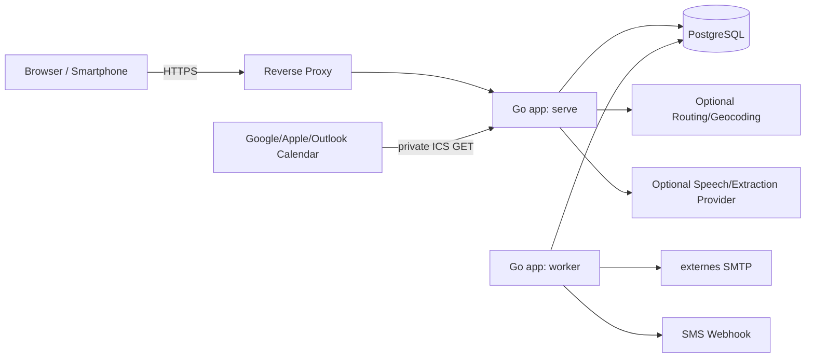

# Architektur

## Entscheidung

HackWerk wird als **modularer Monolith** gebaut: ein Repository, ein Go-Modul, ein PostgreSQL-Schema und ein Binary mit mehreren Betriebsmodi. Webprozess und Worker laufen als getrennte Container desselben Images.

Diese Form hält Deployment und Transaktionen einfach, während Domänengrenzen spätere Extraktion ermöglichen.

## Laufzeitübersicht



## Container in Development

- `app`: HTTP-Server und serverseitige UI;
- `worker`: Outbox, E-Mail, SMS und zeitgesteuerte Aufräumarbeiten;
- `postgres`: alleinige persistente Datenbank;
- externer SMTP-Dienst: nur für Versand über statisch validierte Worker-Konfiguration und TLS; lokale/CI-Tests verwenden einen Fake-Adapter; kein E-Mail-Empfang;
- optional ein Dev-Asset-Watcher, wenn nicht im App-Container integriert.

Kein Redis ist für den initialen Umfang nötig. Sessions, Locks, Outbox, Rate-Limit-Zähler mit geringer Last und Caches können in PostgreSQL bzw. Prozessspeicher abgebildet werden. Prozesslokale Rate Limits dienen nur als zusätzliche Schicht; sicherheitskritische Einmaligkeit wird in der Datenbank durchgesetzt.

## Anwendungsschichten

```text
internal/<domain>/domain.go       Entitäten, Value Objects, Statusregeln
internal/<domain>/service.go      Use Cases und Transaktionsgrenzen
internal/<domain>/ports.go        kleine Interfaces für Persistenz/Provider
internal/adapters/...             PostgreSQL, SMTP, SMS, Routing, Speech
internal/web/...                  Handler, Middleware, View Models
web/templates/...                 templ-Komponenten
web/assets/static/...             direkt eingebettetes JavaScript und CSS
```

HTTP-Handler:

1. authentifizieren und Request parsen;
2. DTO validieren;
3. Use Case aufrufen;
4. Fehler in stabile HTTP-Antworten übersetzen;
5. HTML-Fragment oder JSON zurückgeben.

Handler dürfen keine SQL-Queries und keine Statusmutation direkt ausführen.

## Domänenmodule

- `auth`: Login, Sessions, Passwortwechsel, Rollen;
- `users`: Benutzerverwaltung;
- `customers`: Kundenakte, Adresse, Kontakt, Archivierung;
- `jobs`: Hackauftrag, Transportanforderung, Wunschzeitraum, Notizen;
- `waitlist`: Warteschlangenmetadaten, Sortierung, Priorität;
- `drivers`: Fahrerprofile und Zuordnung zu Benutzern;
- `availability`: Wochenregeln und Ausnahmen;
- `resources`: Maschinen/Fahrzeuge und deren Aktivität;
- `scheduling`: Termine, Zuweisungen, Reservierungen, Konflikte;
- `notifications`: Templates, Outbox, Versandstatus;
- `confirmation`: öffentliche Antwortlinks und Antworten;
- `calendarfeed`: ICS-Export und private Feeds;
- `planning`: Kandidaten, Scoring, Fahrzeitadapter;
- `voice`: Audioaufnahme, Transkription, Parsing, Entwürfe;
- `audit`: unveränderlicher fachlicher Audit-Trail;
- `dashboard`: read-only Aggregationen und Konfliktindikatoren.

## Persistenz

- IDs als PostgreSQL `uuid`;
- alle fachlichen Tabellen mit `created_at`, `updated_at` und wo nötig `version`;
- Zeiten als `timestamptz`, lokale Datumswünsche als `date`;
- Geld ist nicht Teil von 1.0;
- Mengen als `numeric`, Dauern als ganze Minuten;
- strukturierte Kernfelder als Spalten, `jsonb` nur für Provider-Metadaten oder nachvollziehbare Snapshots;
- Abfragen mit `sqlc`, Transaktionen mit `pgx`;
- Indizes für Status, Datumsbereiche, Wartelistensortierung und Suche.

## Termin-Parallelität

Der Browser darf Konflikte vorab anzeigen, aber nur die Datenbank entscheidet verbindlich.

- `appointments.version` wird bei jeder planungsrelevanten Änderung erhöht.
- Move/Resize/Fix erwartet die gelesene Version.
- Fahrer- und Ressourcenreservierungen verwenden halboffene Zeiträume `[start,end)`.
- PostgreSQL-Exclusion-Constraints verhindern Überschneidungen für dieselbe aktive Ressource bzw. denselben Fahrer.
- Termin, Zuweisungen, Reservierungen und Outbox-Ereignis werden in einer Transaktion geändert.
- Ein Versionskonflikt ergibt HTTP `409` mit aktuellem Event; FullCalendar ruft `revert()` auf und lädt neu.

## Nebenwirkungen

Benachrichtigungen werden nie direkt im Request versendet.

```text
Admin fixiert Termin
  -> DB-Transaktion: Terminstatus + Audit + Outbox
  -> Commit
  -> Worker claimt Outbox-Zeile mit SKIP LOCKED
  -> Provideraufruf mit Idempotency Key
  -> Versandstatus + Retry/Dead Letter
```

## Frontend

- `templ` rendert Seiten und Fragmente;
- `htmx 2.x` übernimmt Formulare, Tabellenfilter, Modals und partielle Aktualisierungen;
- FullCalendar `v7.x` übernimmt Tag/Woche, externe Drags, Move und Resize;
- kleines browsernatives JavaScript enthält dünne Adapter zwischen Kalender und HTTP-Endpunkten;
- keine SPA-Global-State-Library;
- kein Node, npm oder JavaScript-Buildschritt; benötigte Browserbibliotheken werden als geprüfte, fest versionierte Distributionsdateien eingecheckt und zusammen mit eigenem CSS/JavaScript in das Go-Binary eingebettet;
- native `<dialog>`-Elemente oder zugängliche Dialogkomponenten;
- kein CDN und kein Inline-`eval`.

## Integrationsports

```go
// sinngemäß, nicht verbindlicher Quellcode
type MailSender interface { Send(ctx context.Context, msg MailMessage) (ProviderReceipt, error) }
type SMSSender interface { Send(ctx context.Context, msg SMSMessage) (ProviderReceipt, error) }
type Geocoder interface { Geocode(ctx context.Context, address Address) (Location, error) }
type Router interface { Matrix(ctx context.Context, points []Location) (TravelMatrix, error) }
type Transcriber interface { Transcribe(ctx context.Context, audio AudioInput) (Transcript, error) }
type IntakeExtractor interface { Extract(ctx context.Context, transcript string) (VoiceDraft, error) }
```

Jeder Port benötigt mindestens einen Fake-Adapter. Optionale externe Provider dürfen bei Ausfall nicht die manuelle Kernplanung blockieren.

## Betrieb

- ein unveränderliches Multi-Stage-Image;
- non-root Nutzer;
- read-only Root-Filesystem, beschränktes `tmpfs` für temporäres Audio;
- eingebettete Zeitzonendaten und CA-Zertifikate;
- `serve`, `worker`, `migrate` aus demselben Image;
- `/health/live` ohne DB, `/health/ready` mit DB/Schema-Prüfung;
- strukturierte JSON-Logs nach stdout;
- Prometheus-Metriken auf intern geschütztem Endpunkt;
- Reverse Proxy terminiert TLS und setzt nur aus vertrauenswürdigen Netzen Forwarded Header.
