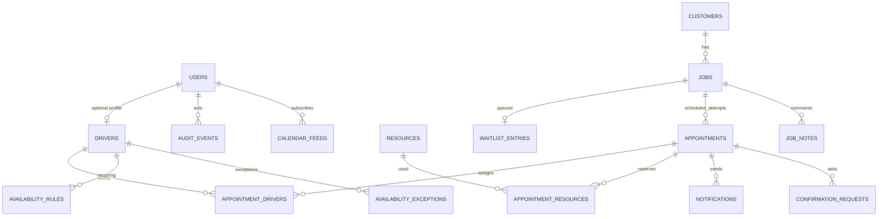

# Domänen- und Datenmodell

## Leitgedanke

Ein **Kunde** ist die Person/Firma. Ein **Auftrag** beschreibt die konkrete Hackarbeit. Ein **Termin** reserviert Zeit, Fahrer und Ressourcen für diesen Auftrag. Dadurch bleiben Historie, Wiederholungsaufträge und abgelehnte Termine sauber modellierbar.

## Beziehungen

## `users`

- `id uuid pk`
- `username citext unique`
- `display_name text`
- `email citext null`
- `role enum/admin|driver`
- `password_hash text`
- `must_change_password bool`
- `active bool`
- `last_login_at timestamptz null`
- Zeitstempel

Keine öffentliche Registrierung. Benutzer werden durch Admin oder CLI erzeugt.

## `drivers`

- `id uuid pk`
- `user_id uuid unique null`
- `display_name text`
- `phone text null`
- `email citext null`
- `active bool`
- `can_complete_jobs bool default true`
- optionale interne Bemerkung

Ein Fahrer kann vorab geplant werden, auch wenn noch kein Login existiert. Ein Benutzer kann höchstens einem Fahrerprofil zugeordnet sein.

## `customers`

- `id uuid pk`
- `first_name`, `last_name`
- `company_name null`
- `street`, `postal_code`, `locality`, `region`, `country_code default AT`
- `address_freeform` für unvollständige/gesprochene Angaben
- `phone_raw`, `phone_normalized null`
- `email citext null`
- `notification_preference enum/email|sms|both|none`
- `latitude`, `longitude null`
- `location_source enum/manual|geocoder|null`
- `geocoding_status enum/not_requested|pending|resolved|failed|needs_review`
- `archived_at null`
- `version`
- Zeitstempel

Der Maps-Link wird aus Koordinaten oder URL-kodierter Adresse generiert und nicht als vertrauenswürdige beliebige URL gespeichert.

## `jobs`

- `id uuid pk`
- `job_number text unique`, z. B. `HA-2026-0001`
- `customer_id fk`
- `job_type enum/chipping_only|chipping_with_transport`
- `volume_m3 numeric(10,2)`
- `estimated_hack_minutes int`
- `estimated_transport_minutes int default 0`
- `transport_trip_count int default 0`
- `transport_mode enum/none|internal|external|undecided`
- `external_transport_confirmed bool default false`
- `preferred_start_date date null`
- `preferred_end_date date null`
- `preference_text text null`
- `urgency enum/low|normal|high|urgent`
- `region text null`
- `source enum/phone|voice|email|in_person|other`
- `workflow_status enum/waitlist|planning|scheduled|completed|cancelled`
- `received_at timestamptz`
- `archived_at null`
- `version`
- Zeitstempel

Validierungen:

- Menge > 0;
- Hackdauer > 0;
- Enddatum nicht vor Startdatum;
- `chipping_only` setzt Transportwerte auf null/0/none;
- `chipping_with_transport` verlangt eine Transportplanung spätestens vor Fixierung;
- ein Auftrag kann mehrere historische Termine, aber höchstens einen aktiven nicht stornierten Termin haben.

## `waitlist_entries`

- `id uuid pk`
- `job_id uuid unique`
- `entered_at timestamptz`
- `manual_priority int default 0`
- `position_hint numeric null`
- `region_snapshot text null`
- `removed_at null`
- `removed_reason enum/scheduled|cancelled|duplicate|other null`

Der Wartelistenstatus wird nicht nur aus einem UI-Array abgeleitet. Die Datenbank bewahrt Eingang und Entfernungshistorie.

## `resources`

- `id uuid pk`
- `resource_type enum/chipper|transport_vehicle|trailer|other`
- `name text`
- `exclusive bool default true`
- `active bool`
- `capacity_metadata jsonb`
- `notes text null`
- Zeitstempel

Es gibt keine Singleton-Tabelle „Hackmaschine“. Die Entwicklung seedet eine Ressource `Hackmaschine 1` vom Typ `chipper`.

## `appointments`

- `id uuid pk`
- `job_id fk`
- `lifecycle_status enum/draft|proposal|fixed|cancelled|completed`
- `confirmation_status enum/not_requested|pending|confirmed|declined|callback_requested`
- `starts_at timestamptz`
- `ends_at timestamptz`
- `customer_visible_start_at timestamptz`
- `planned_buffer_minutes int default 0`
- `admin_note text null`
- `fixed_at`, `fixed_by null`
- `cancelled_at`, `cancelled_by`, `cancel_reason null`
- `completed_at`, `completed_by null`
- `version int`
- Zeitstempel

`ends_at > starts_at`. Für V1 blockiert der Termin die gesamte geplante Hack-/Transportdauer. Eine spätere Segmenttabelle kann Reise-, Hack- und Transportphasen getrennt abbilden, ohne Kunde/Auftrag/Termin zu vermischen.

## Zuweisungen und Reservierungen

### `appointment_drivers`

- `appointment_id`, `driver_id`
- `is_primary bool`
- `reserved_range tstzrange`
- Exclusion Constraint auf `(driver_id WITH =, reserved_range WITH &&)`

### `appointment_resources`

- `appointment_id`, `resource_id`
- `purpose enum/chipping|transport|support`
- `reserved_range tstzrange`
- Exclusion Constraint auf `(resource_id WITH =, reserved_range WITH &&)`

Nur aktive Termine besitzen aktive Reservierungszeilen. Abbruch entfernt oder deaktiviert sie innerhalb derselben Transaktion.

## Fahrer-Verfügbarkeit

### `availability_rules`

- Fahrer, Wochentag 1–7, lokale Start-/Endzeit;
- Gültigkeitsbereich als Datum;
- Status `available` oder `limited`;
- optionale Notiz.

### `availability_exceptions`

- Fahrer;
- UTC-Zeitraum oder ganzer lokaler Tag;
- Typ `vacation`, `sick`, `unavailable`, `available_override`, `other`;
- Sichtbarkeit der Begründung nur intern.

Ausnahmen übersteuern Wochenregeln. Fixierung erfordert mindestens einen zugewiesenen verfügbaren Fahrer oder einen expliziten Admin-Override mit Begründung und Audit.

## Notizen

`job_notes` sind append-only mit Autor und Zeitstempel. Änderungen erfolgen als neue Notiz oder klar auditierte Korrektur. Fahrer dürfen ergänzen, nicht fremde Notizen unbemerkt überschreiben.

## Benachrichtigung und Bestätigung

### `outbox_events`

Fachliches Event, Payload, Status, Versuchszähler, `available_at`, Claim/Lock, letzter redigierter Fehler.

### `notifications`

Kanal, Empfänger, Templateversion, Snapshot der fachlichen Parameter, Provider-ID, Status und Versuche. Nachrichtentext kann verschlüsselt oder minimiert gespeichert werden; technische Logs enthalten ihn nicht.

### `confirmation_requests`

- Termin;
- Hash eines 256-Bit-Tokens;
- Ablaufdatum;
- Status aktiv/widerrufen/verbraucht;
- Antwort und Antwortzeit;
- `token_version` für erneutes Versenden.

Der Roh-Token existiert nur beim Erzeugen und im Kundenlink.

## Kalenderfeed

`calendar_feeds` enthält Benutzer, Hash des Feed-Tokens, Filter, aktiv/widerrufen, Zeitstempel und optional `last_used_at`. Der Feed ist read-only und besitzt keinen Login-Cookie.

## Planung und Sprache

Planungsvorschläge dürfen als nachvollziehbarer Run mit Inputversion, Scorekomponenten und Ablaufzeit gespeichert werden. Sprachentwürfe speichern standardmäßig Transkript und strukturierte Felder kurzzeitig, nicht das Audio. Ein Commit erzeugt Kunde/Auftrag/Wartelisteneintrag in einer Transaktion.

## Audit

`audit_events` enthält Actor-Typ, Actor-ID, Aktion, Objekt, Objekt-ID, Zeit, Request-ID und minimierte Metadaten/Changed-Field-Namen. Keine Passwort-Hashes, Tokens, Audioinhalte oder vollständigen Kontaktfelder in Audit-Snapshots.
